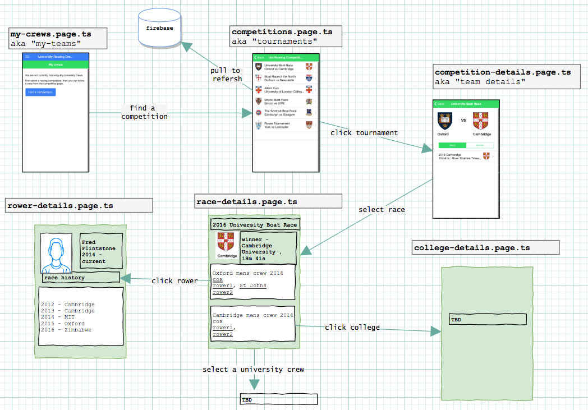

# study-ionic2

ionic sandbox; demo rowing app. 

* simple firebase db
* simple json database configuration. [db-seed.json](db-seed.json)

## Mockup so far

## references

* [Ionic 2 Tutorial](http://ionicframework.com/docs/v2/intro/tutorial/)
* https://robots.thoughtbot.com/controlling-color-with-sass-color-functions
