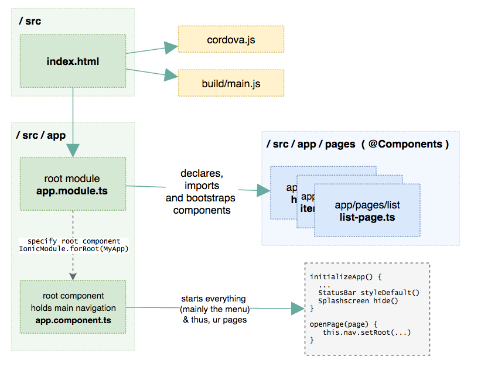

# My Ionic2 files quick reference

## `/src`

> `index.html`

1. Generic entry point contains `<ion-ap></ion-app>`
1. this file loads the frameworks and your app `app.module`

## `/src/app`

> `app/app.module.ts`

1. this file *is* your app (technically it's theroot **module**) and is the actual configuration of your SPA.
1. this file contains the logic to bootstrap your SPA (inside the frameworks loaded by `index.html`)
1. this module defines which is the root **component** ; the first component (page) that gets loaded in the app. 

> `app/`

1. adsasda

## references

* http://ionicframework.com/docs/v2/intro/tutorial/project-structure/